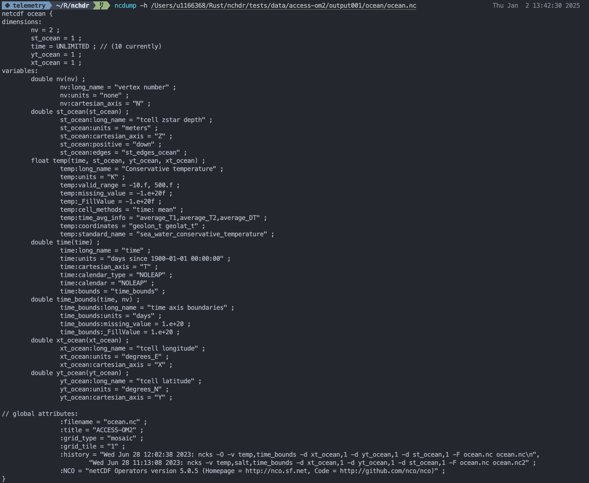
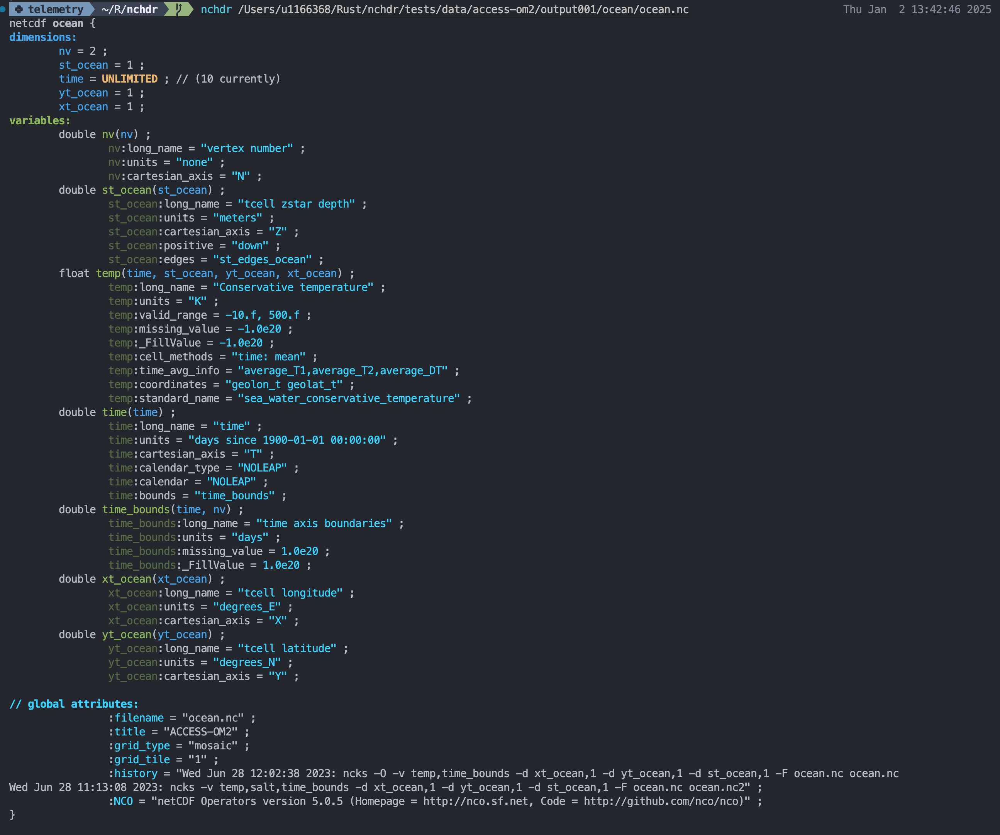

# NCHDR: A dead simple, colourised netCDF file header viewer, written in rust.

My use case for ncdump is *almost exclusively* `ncdump -h $FILE`. 

This presents two mild inconveniences:

1. Output is not colourised. This is kind of annoying.
2. It's too many characters to type.

This tool solves these glaring errors, by providing shorter command name, and colourising the output. It mostly exists because I wanted to write a CLI tool in Rust. For reference, I'm using the output of `ncdump -h` as a target for what this tool should output.

## Installation

- Clone this repository
- Run `cargo build --release`
- Copy the binary from `target/release/nchdr` to somewhere in your `$PATH`.

You will probably also need to update the rpath configurations in config.toml to link to the correct location of the netCDF library on your system. Fixing this is on my radar.

## Usage

```bash
nchdr $FILE
```

## Gallery

### Before



### After


## Options

- `--help`: Show help message and exit... Currently not implemented.

## Contributing

Feel free to contribute! With that in mind, this tool is intentionally simple.
